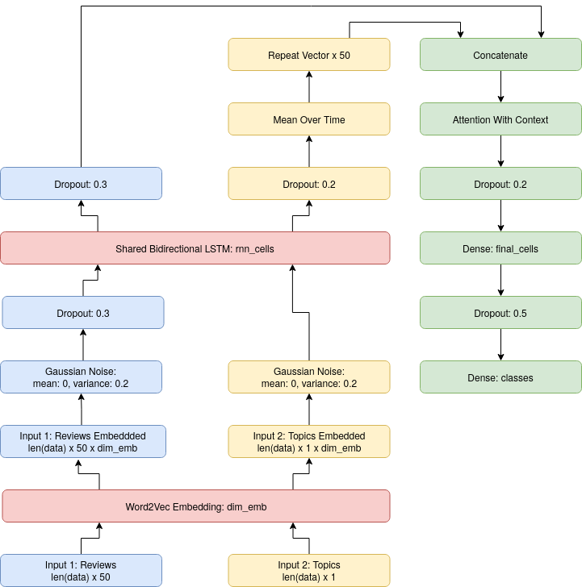

# Human Language Technologies [2019-2020] project implementation: Deep Learning Topic Based Sentiment Analysis

This model can perform Aspect Category Detection and Aspect Category Polarity.
## How to tun the code
To install the requirements: 

> pip install -r requirements.txt

From the [train](train.py) files, you can say to the model which task it needs to learn (modifying *TASK* with *acd* or *acd*), which embedding to use (modifying *EMB* with *w2v* or *alberto*), if you want to perform validation (setting *VALIDATION* to true, this will save the grid search results inside logs/EMB/TASK/hparam_tuning that can be visualize with Tensorboard) and which is the hidden dimensions that you want to use (these are effective only if *VALIDATION* is false).
To test a model with the Absita official evaluation script, you need to run

> python [test.py](test.py)

Settings the right values of the hidden dimensions, that can be seen from the checkpoint directory (*checkpoints/EMB/TASK/model_rnn_cells_final_cells).
To visualize the training history obtained, you just need to do

> tensorboard --logdir logs/EMB/TASK/final_training

this will create the temporary files *data/emb_tas_results.csv* and call the [evaluation Absita script](data/raw/evaluation_absita.py) with the right parameters.